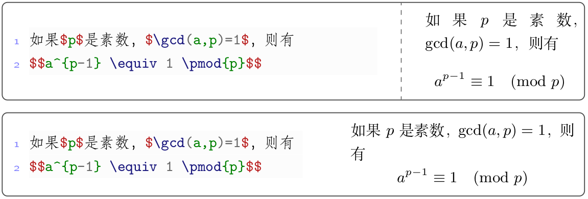
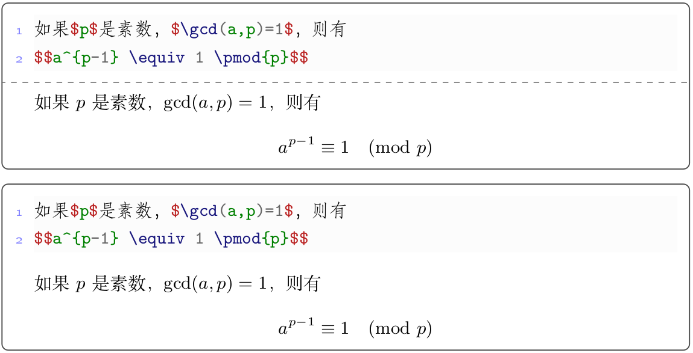

# texboxie.sty

#### 项目介绍
这是一个用tcolorbox宏包结合minted宏包或listings宏包同时排版LaTeX代码片段及该代码片段排版结果的盒子的宏包，其灵感来自于暨南大学数学系吕荐瑞的LaTeX 文档排版教程( https://lvjr.bitbucket.io/latex.html?2018 )和自己开发的的boxiesty宏包( https://github.com/registor/boxiesty )。

可以用：\usepackage{texboxie}加载该宏包。

#### 排版样例
1. 排版样例




2. 更多样例请参考`main.tex`

###更新内容
该宏包定义了4个环境用于实现不同类型的排版要求：

1. `codeony`环境用于仅输出\LaTeX 源代码片段：
   ```
   \begin{codeony}

     ...

   \end{codeony} 
   ```
2. `outony`环境用于仅输出\LaTeX 源代码片段排版结果：
   ```
   \begin{outony}

     ...

   \end{outony} 
   ```
3. `texdemoh`环境用于输出水平方向同时输出\LaTeX 源代码片段和排版结果：
   ```
   \begin{texdemoh}[*][w]

     ...

   \end{texdemoh} 
   ```
   其中，*表示要不要分割虚线，w表示左半部占有的宽度比例。
4. `texdemov`环境用于输出垂直方向同时输出\LaTeX 源代码片段和排版结果：
   ```
   \begin{texdemov}[*]

     ...

   \end{texdemov} 
   ```
   其中，*表示要不要分割虚线。

#### 软件架构
1. 采用LaTeX撰写，需要ctex宏包支持中文、minted宏包或listings宏包支持代码编排。

#### 使用说明

1. LaTeX的编译命令是：xelatex -shell-escape -interaction=nonstopmode，其中-shell-escape是使用minted宏包需要的参数。
2. 如果LaTeX编译时无--shell-escape参数，则使用listings排版代码。
3. 既可以在各类IDE中执行编译，可以在当前目录的命令行执行：make 命令进行编译
4. 在当前目录的命令行执行：make clean可以清理中间过程文件
5. 编译结果是PDF文件，请使用合适的软件进行查看。

#### 参与贡献

1. 本项目由西北农林科技大学信息工程学院耿楠创建和维护
2. 如果您愿意一同参与工作(不计报酬，免费自由)，请及时与作者联系
